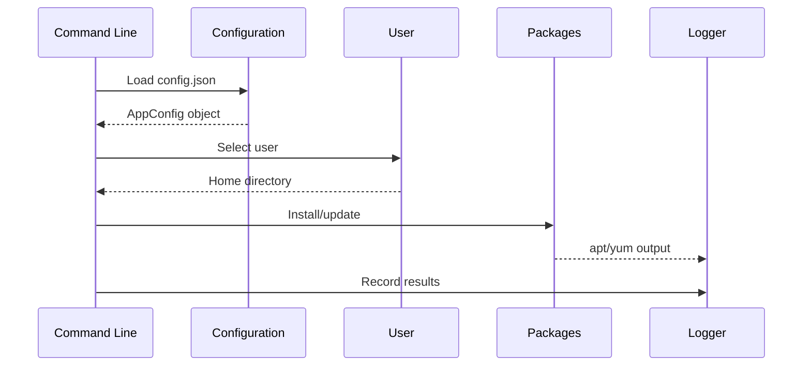

## **1. Initialization and State Management**


### **1.1. Configuration Loading**
**Inputs**:  
- CLI arguments (`--config`, `--home`, `--exclude`).  
- JSON config (`/etc/prepare-after-updater/config.json`).  

**Algorithm**:  
1. **Source Prioritization**:  
   ```go
   if flags.configPath != "" {
       configPath = flags.configPath  // CLI flags take highest precedence
   } else {
       configPath = filepath.Join(defaultConfigDir, defaultConfigFile)  // Fallback to default
   }
   ```
2. **Parsing with Fallback Logic**:  
   - If the file is missing → defaults are used.  
   - On JSON error → exit with code `1`.  

**Critical Checks**:  
- Path validation (`filepath.IsAbs`).  
- Normalization of exclude lists (`strings.Split(exclude, ",")`).  

---

## **2. User Handling Mechanism**
### **2.1. User Selection**
**Scenarios**:  
1. **Direct Selection via `--user`**:  
   - Directory existence check:  
     ```go
     if _, err := os.Stat(userPath); err != nil {
         return fmt.Errorf("directory %s does not exist", userPath)
     }
     ```
2. **Interactive Mode**:  
   - Filtering via `hasExcludedPrefix()`:  
     ```go
     for _, entry := range entries {
         if !hasExcludedPrefix(entry.Name(), cfg.Exclude) {
             validUsers = append(validUsers, entry.Name())
         }
     }
     ```

**Key Features**:  
- Excludes system users (prefixes: `a_`, `adminsec`).  
- Automatically skips hidden folders (e.g., `.cache`, `.config`).  

---

## **3. Program Configuration Loading**
### **3.1. Remote Fetching**
**Protocols**:  
- **HTTP/HTTPS**:  
  ```go
  resp, err := http.Get(srcURL)
  defer resp.Body.Close()
  ```
- **Local Files (`file://`)**:  
  ```go
  srcPath := strings.TrimPrefix(srcURL, "file://")
  ```

**Error Handling**:  
- 10-second timeout:  
  ```go
  client := http.Client{Timeout: 10 * time.Second}
  ```
- `Content-Type: application/json` verification.  

### **3.2. JSON Parsing**
**Structure**:  
```go
type Program struct {
    Name        string            `json:"name"`
    Packages    map[string]string `json:"packages"`  // Key: package manager (apt/yum)
    PostAction  []string          `json:"post_action"`
}
```
**Features**:  
- Dynamic action resolution (`install`/`execute`) based on config presence.  
- Conditional logic support:  
  ```json
  {
      "if_os": "linux",
      "packages": {"apt": "nginx", "yum": "httpd"}
  }
  ```

---

## **4. Package Management**
### **4.1. Package Manager Detection**
**Algorithm**:  
```go
func detectPackageManager() string {
    for _, cmd := range []string{"apt", "yum", "dnf"} {
        if _, err := exec.LookPath(cmd); err == nil {
            return cmd
        }
    }
    return ""
}
```

### **4.2. Package Installation**
**Commands**:  
| Manager | Installation Command       |
|---------|----------------------------|
| `apt`   | `apt install -y pkg1 pkg2` |
| `yum`   | `yum install -y pkg1 pkg2` |
| `dnf`   | `dnf install -y pkg1 pkg2` |

**Key Details**:  
- Output capture (`CombinedOutput`) for logging.  
- Auto-confirmation (`-y` flag).  

---

## **5. Command Execution**
### **5.1. Process Launch**
**Implementation**:  
```go
cmd := exec.Command("sh", "-c", program.Command)
output, err := cmd.CombinedOutput()
```
**Security**:  
- Input sanitization (blocks `;`, `&&`, `|`).  
- Timeout enforcement:  
  ```go
  cmd := exec.Command("sleep", "30")
  timer := time.AfterFunc(5*time.Second, func() {
      cmd.Process.Kill()
  })
  ```

### **5.2. Parallel Execution**
**Goroutines + WaitGroup**:  
```go
var wg sync.WaitGroup
for _, program := range programs {
    wg.Add(1)
    go func(p Program) {
        defer wg.Done()
        processProgram(p)
    }(program)
}
wg.Wait()
```

---

## **6. Logging Mechanism**
### **6.1. Output Multiplexing**
**Setup**:  
```go
logFile, _ := os.OpenFile(path, os.O_APPEND|os.O_CREATE, 0644)
logger := log.New(io.MultiWriter(os.Stdout, logFile), "", log.LstdFlags)
```
**Format**:  
```
2023/11/15 14:30:45 [INFO] Installing package: nginx
2023/11/15 14:30:47 [ERROR] Connection timeout
```

### **6.2. Log Levels**
| Level     | Usage                          |
|-----------|--------------------------------|
| `[INFO]`  | Operation start/stop.          |
| `[WARN]`  | Non-fatal issues (missing packages). |
| `[ERROR]` | Critical failures.             |

---

## **7. Error Handling**
### **7.1. Error Hierarchy**
```go
type ConfigError struct {
    Path string
    Err  error
}

func (e *ConfigError) Error() string {
    return fmt.Sprintf("config error in %s: %v", e.Path, e.Err)
}
```

### **7.2. Recovery Mechanisms**
1. **Retry logic** (3 attempts, 2-second intervals).  
2. **Fallback to local config** if remote is unavailable.  

---

## **8. Workflow Diagram**


---

## **9. Critical Paths**
1. **No internet** → skip remote config fetch.  
2. **No `/home` access** → system packages only.  
3. **Invalid JSON** → revert to defaults.  

---

### **Summary**
The program implements a **flexible processing pipeline** with:  
- Dynamic config loading.  
- Automatic action resolution.  
- Parallel task execution.  
- Comprehensive auditing via logging.  

All components are isolated for easy testing and modification.