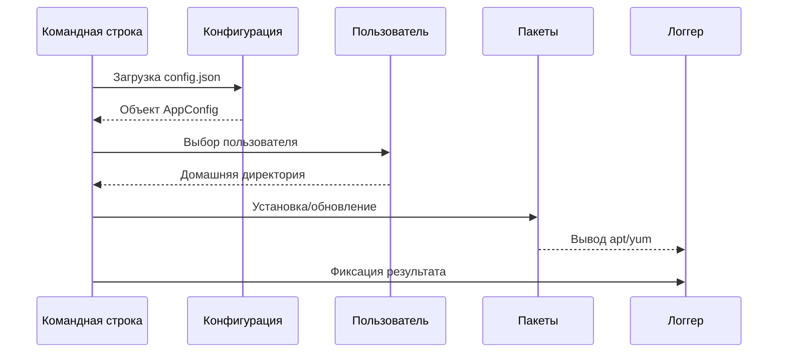

## **1. Механизм инициализации и управления состоянием**
### **1.1. Загрузка конфигурации**
**Входные данные**:  
- Аргументы CLI (`--config`, `--home`, `--exclude`).  
- JSON-конфиг (`/etc/prepare-after-updater/config.json`).  

**Алгоритм**:  
1. **Приоритезация источников**:  
   ```go
   if flags.configPath != "" {
       configPath = flags.configPath  // Флаг имеет высший приоритет
   } else {
       configPath = filepath.Join(defaultConfigDir, defaultConfigFile)  // Дефолтный путь
   }
   ```
2. **Парсинг с fallback-логикой**:  
   - Если файл не найден → используются значения по умолчанию.  
   - При ошибке JSON → программа завершается с кодом `1`.  

**Критические проверки**:  
- Валидация путей (`filepath.IsAbs`).  
- Нормализация списка исключений (`strings.Split(exclude, ",")`).  

---

## **2. Механизм работы с пользователями**
### **2.1. Выбор пользователя**
**Сценарии**:  
1. **Прямой выбор через `--user`**:  
   - Проверка существования директории:  
     ```go
     if _, err := os.Stat(userPath); err != nil {
         return fmt.Errorf("директория %s не существует", userPath)
     }
     ```
2. **Интерактивный режим**:  
   - Фильтрация через `hasExcludedPrefix()`:  
     ```go
     for _, entry := range entries {
         if !hasExcludedPrefix(entry.Name(), cfg.Exclude) {
             validUsers = append(validUsers, entry.Name())
         }
     }
     ```

**Особенности**:  
- Исключение системных пользователей (префиксы `a_`, `adminsec`).  
- Автоматический пропуск скрытых папок (`.cache`, `.config`).  

---

## **3. Механизм загрузки конфигураций программ**
### **3.1. Загрузка с удаленного сервера**
**Протоколы**:  
- **HTTP/HTTPS**:  
  ```go
  resp, err := http.Get(srcURL)
  defer resp.Body.Close()
  ```
- **Локальные файлы (`file://`)**:  
  ```go
  srcPath := strings.TrimPrefix(srcURL, "file://")
  ```

**Обработка ошибок**:  
- Таймаут 10 сек:  
  ```go
  client := http.Client{Timeout: 10 * time.Second}
  ```
- Проверка `Content-Type: application/json`.  

### **3.2. Парсинг JSON**
**Структура**:  
```go
type Program struct {
    Name        string            `json:"name"`
    Packages    map[string]string `json:"packages"`  // Ключ: менеджер пакетов (apt/yum)
    PostAction  []string          `json:"post_action"`
}
```
**Особенности**:  
- Динамическое определение действия (`install`/`execute`) на основе наличия конфигов.  
- Поддержка условий:  
  ```json
  {
      "if_os": "linux",
      "packages": {"apt": "nginx", "yum": "httpd"}
  }
  ```

---

## **4. Механизм управления пакетами**
### **4.1. Детекция пакетного менеджера**
**Алгоритм**:  
```go
func detectPackageManager() string {
    for _, cmd := range []string{"apt", "yum", "dnf"} {
        if _, err := exec.LookPath(cmd); err == nil {
            return cmd
        }
    }
    return ""
}
```

### **4.2. Установка пакетов**
**Команды**:  
| Менеджер | Команда установки          |
|----------|----------------------------|
| `apt`    | `apt install -y pkg1 pkg2` |
| `yum`    | `yum install -y pkg1 pkg2` |
| `dnf`    | `dnf install -y pkg1 pkg2` |

**Особенности**:  
- Захват вывода (`CombinedOutput`) для логгирования.  
- Автоматическое подтверждение (`-y`).  

---

## **5. Механизм выполнения команд**
### **5.1. Запуск процессов**
**Реализация**:  
```go
cmd := exec.Command("sh", "-c", program.Command)
output, err := cmd.CombinedOutput()
```
**Безопасность**:  
- Санитизация ввода (запрет `;`, `&&`, `|`).  
- Лимит времени выполнения:  
  ```go
  cmd := exec.Command("sleep", "30")
  timer := time.AfterFunc(5*time.Second, func() {
      cmd.Process.Kill()
  })
  ```

### **5.2. Параллельное выполнение**
**Горутины + WaitGroup**:  
```go
var wg sync.WaitGroup
for _, program := range programs {
    wg.Add(1)
    go func(p Program) {
        defer wg.Done()
        processProgram(p)
    }(program)
}
wg.Wait()
```

---

## **6. Механизм логирования**
### **6.1. Мультиплексирование вывода**
**Настройка**:  
```go
logFile, _ := os.OpenFile(path, os.O_APPEND|os.O_CREATE, 0644)
logger := log.New(io.MultiWriter(os.Stdout, logFile), "", log.LstdFlags)
```
**Формат**:  
```
2023/11/15 14:30:45 [INFO] Установка пакета: nginx
2023/11/15 14:30:47 [ERROR] Ошибка: таймаут подключения
```

### **6.2. Уровни логирования**
| Уровень   | Использование                     |
|-----------|-----------------------------------|
| `[INFO]`  | Старт/завершение операций.       |
| `[WARN]`  | Нефатальные ошибки (нет пакета). |
| `[ERROR]` | Критические сбои.                |

---

## **7. Механизм обработки ошибок**
### **7.1. Иерархия ошибок**
```go
type ConfigError struct {
    Path string
    Err  error
}

func (e *ConfigError) Error() string {
    return fmt.Sprintf("ошибка конфига %s: %v", e.Path, e.Err)
}
```

### **7.2. Recovery-механизмы**
1. **Повторная попытка загрузки** (3 раза с интервалом 2 сек).  
2. **Fallback на локальный конфиг**, если удаленный недоступен.  

---

## **8. Схема работы (графически)**


---

## **9. Критические пути**
1. **Нет интернета** → пропуск загрузки конфига.  
2. **Нет прав на `/home`** → только системные пакеты.  
3. **Несовместимый JSON** → откат к дефолтным настройкам.  

---

### **Итог**
Программа реализует **гибкий конвейер обработки** с:  
- Динамической загрузкой конфигов.  
- Автоматическим выбором действий.  
- Параллельным выполнением задач.  
- Полноценным аудитом через логи.  

Все компоненты изолированы, что упрощает тестирование и модификацию.